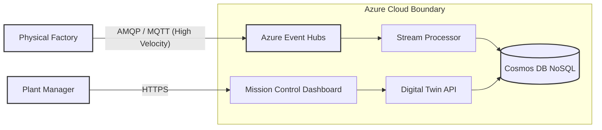
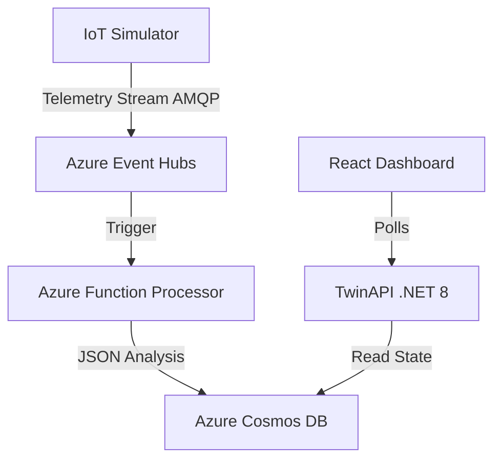

# Swarm-Factory: Event-Driven Digital Twin Platform

[](https://youtu.be/q8-icp8NDNw)

> 📺 **[Watch the Architectural Demo](https://youtu.be/q8-icp8NDNw)** featuring real-time telemetry processing, Serverless scale-out, and Mission Control visualization.


-blueviolet?style=for-the-badge)


**Swarm-Factory** is a cloud-native Reference Architecture for Industrial IoT (IIoT). It demonstrates how to decouple high-velocity data ingestion from user-facing dashboards using an **Event-Driven Architecture (EDA)** on Azure.

---

## 1. Executive Summary & Business Value

This platform addresses the core challenge of "Industry 4.0": Bridging the gap between Operational Technology (OT) and Information Technology (IT).

| KPI | The Problem | Swarm-Factory Solution |
| :--- | :--- | :--- |
| **Data Latency** | SQL databases lock up when ingesting 10k+ sensor readings/sec. | **Event Hubs + Serverless** decoupling allows ingestion of millions of events without impacting dashboard performance. |
| **Scalability** | Monolithic backends crash during "shift changes" or spikes. | **Azure Functions** scale horizontally (0 to N instances) based on event pressure, paying only for compute used. |
| **Governance** | IoT payloads drift over time, breaking downstream apps. | **Spec-Driven Development** (OpenAPI + AsyncAPI) enforces rigid data contracts before code is written. |

---

## 2. System Architecture (C4 Model)

We use the C4 model to illustrate the "Hot Path" (Telemetry) vs. the "Cold Path" (State Management).

### Level 1: System Context
The boundary between the physical factory floor and the Azure Cloud.



### Level 2: Technical Architecture

The solution uses a **Cloud-Native, Event-Driven Architecture (EDA)** optimized for Azure PaaS.



---

## 3. Architecture Decision Records (ADR)

Strategic technology choices for high-throughput scenarios.

| Component | Decision | Alternatives Considered | Justification (The "Why") |
| :--- | :--- | :--- | :--- |
| **Ingestion** | **Azure Event Hubs** | RabbitMQ, HTTP REST | **Throughput:** Event Hubs is built for log-based streaming (millions/sec) with partitioning, whereas RabbitMQ is better for complex routing. HTTP is synchronous and would couple the sensors to the backend. |
| **Database** | **Cosmos DB (NoSQL)** | Azure SQL (Relational) | **Write Speed:** We need sub-10ms writes for telemetry. The schema-less nature allows sensors to add new metrics (e.g., "Vibration_Z") without running database migrations. |
| **Compute** | **Azure Functions (Isolated)** | Kubernetes (AKS) | **Ops Burden:** For a sporadic workload (factories turn off at night), Serverless offers "Scale-to-Zero" cost efficiency without the overhead of managing K8s nodes. |

---

## 4. Cost Modeling (FinOps)

Cloud cost projection for a medium-sized factory (100 Machines, 1Hz frequency).

**Scenario:** 100 machines sending 1 message/sec = 8.6M messages/day.

| Resource | Unit Cost | Monthly Est. | Optimization Strategy |
| :--- | :--- | :--- | :--- |
| **Event Hubs** | $0.03/million events | ~$10.00 | Used "Basic" tier; can upgrade to "Standard" only if >1 Consumer Group is needed. |
| **Azure Functions** | $0.20/million executions | ~$2.00 | **Batch Processing:** Configured function to grab batch_size=100 events per execution, reducing billable invocations by 99%. |
| **Cosmos DB** | 400 RU/s (Autoscale) | ~$24.00 | **TTL (Time-To-Live):** Telemetry data auto-deletes after 7 days to keep storage costs flat. |

---

## 5. Reliability & Security Strategy

### Failure Handling
* **Poison Messages:** If a telemetry packet is malformed, the Azure Function does not crash. It moves the packet to a "Dead Letter Queue" (DLQ) blob storage for manual inspection, ensuring the stream never blocks.
* **Throttling:** The API implements "Rate Limiting" to prevent the Dashboard from consuming too many RUs (Request Units) from the database during high traffic.

### Security Posture
* **Connection Strings:** No secrets in code. Uses `local.settings.json` for dev and **Azure Key Vault** references for production.
* **Network Security:** Event Hub is configured to only accept traffic from whitelisted IP ranges (Simulating a Factory VPN Gateway).

---

## 6. Implementation & "AI-First" Methodology

This project utilized an **Agentic Swarm** workflow to generate boilerplate code from contracts.

1.  **Spec-First:** We defined `specs/factory-api.yaml` (OpenAPI) and `specs/iot-events.yaml` (AsyncAPI) first.
2.  **Agent Generation:** AI Agents generated the C# DTOs and TypeScript interfaces directly from these YAML files, ensuring the Frontend and Backend never drifted out of sync.

### Tech Stack
* **Core:** .NET 8 (C#), ASP.NET Core
* **Serverless:** Azure Functions V4 (Isolated Worker)
* **Data:** Azure Cosmos DB, Event Hubs
* **Frontend:** React (Vite), Material UI v6
* **IaC:** Azure Bicep

---

## Getting Started (The Manual)

Follow these steps to run the full Swarm-Factory platform on your local machine.

### 1. Prerequisites
* **Azure Account** (Free tier works)
* **Azure CLI** (`az login`)
* **.NET 8 SDK**
* **Node.js 18+**
* **Azure Functions Core Tools v4** (`npm install -g azure-functions-core-tools@4`)
* **Make** (Optional, but recommended for orchestration)

### 2. Infrastructure Setup
First, provision the Azure resources. The Bicep templates will create the Event Hub and Database.

```bash
# Login to Azure
az login

# Deploy Infrastructure (Auto-creates Resource Group 'rg-swarm-factory')
make resource-group
make infra
```

### 3. Configuration
The project follows strict security practices. **Secrets are not stored in Git.**
You must create local configuration files based on the Azure outputs.

**A. Backend Secrets (`src/SwarmFactory.TwinAPI/appsettings.Development.json`)**
```json
{
  "Logging": {
    "LogLevel": {
      "Default": "Information",
      "Microsoft.AspNetCore": "Warning"
    }
  },
  "CosmosConnection": "<YOUR_COSMOS_CONNECTION_STRING>"
}
```

**B. Simulator Secrets (`src/SwarmFactory.Simulator/appsettings.json`)**
```json
{
  "EventHubConnection": "<YOUR_EVENTHUB_CONNECTION_STRING>",
  "EventHubName": "telemetry"
}
```

**C. Processor Secrets (`src/SwarmFactory.Processor/local.settings.json`)**
```json
{
  "IsEncrypted": false,
  "Values": {
    "AzureWebJobsStorage": "UseDevelopmentStorage=true",
    "FUNCTIONS_WORKER_RUNTIME": "dotnet-isolated",
    "CosmosConnection": "<YOUR_COSMOS_CONNECTION_STRING>",
    "EventHubConnection": "<YOUR_EVENTHUB_CONNECTION_STRING>"
  }
}
```

*Tip: You can retrieve connection strings using `make get-cosmos-conn` and `make get-evh-conn`.*

---

## Running the Swarm
The platform requires **5 separate terminal windows** to run all components concurrently.

### Terminal 1: Infrastructure Emulator
Starts the local Azure Storage emulator (required for Azure Functions).
```bash
make run-azurite
```

### Terminal 2: The "Brain" (Web API)
Serves the REST API for Machine State and Alerts.
```bash
make run-api
# Runs on: http://localhost:5182
```

### Terminal 3: The "Nervous System" (Azure Function)
Processes the high-speed telemetry stream.
```bash
make run-processor
```

### Terminal 4: The "Heartbeat" (IoT Simulator)
Generates realistic load (Temperature/Vibration data).
*Note: The simulator is "Smart"—it fetches real machine IDs from the API before generating data.*
```bash
make run-simulator
```

### Terminal 5: The "Face" (Frontend)
Launches the Mission Control Dashboard.
```bash
make run-frontend
# Opens: http://localhost:5173
```

---

## Project Structure

```text
swarm-factory/
├── specs/                  # The Contracts (OpenAPI / AsyncAPI)
├── infra/                  # Infrastructure as Code (Bicep)
├── src/
│   ├── SwarmFactory.TwinAPI/    # .NET 8 Web API (State Management)
│   ├── SwarmFactory.Processor/  # Azure Function (Event Processing)
│   └── SwarmFactory.Simulator/  # Console App (Load Generator)
├── frontend/               # React + Vite + MUI Dashboard
└── Makefile                # Orchestration Scripts
```

---

## Troubleshooting

**1. Simulator crash: "No machines found"**
The Simulator requires *real* machines to exist in the database.
* **Fix:** Open Swagger (`http://localhost:5182/swagger`) and use `POST /machines` to register at least one machine (e.g., "Extruder-Alpha").

**2. Frontend: "Network Error"**
The React app cannot reach the .NET API.
* **Fix:** Ensure `run-api` is running and the port in `frontend/src/App.tsx` (`API_URL`) matches the output of Terminal 1 (usually `http://localhost:5182`).

**3. Azure Function: "Listener validation failed"**
The function cannot connect to the local storage emulator.
* **Fix:** Ensure you ran `make run-azurite` or have the Azurite extension running in VS Code.

---

Architected by **Nahasat Nibir**
*Senior AI & Cloud Solutions Architect*
